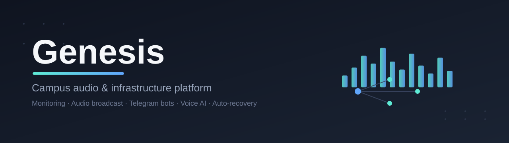

<div align="center">



# Genesis

**Централизованная система управления школьной аудио-трансляцией, мониторингом и IT-инфраструктурой на несколько кампусов.**


</div>

Один сервер, несколько физических точек, единая веб-панель, Telegram-боты и голосовой AI-ассистент — всё написано с нуля одним человеком и растёт с 2026 года.

---

## 📖 История

Всё началось с **одного тонкого клиента неизвестного производителя** — просто нужно было, чтобы в школе вовремя звучал звонок. Сегодня это выросло в полноценную инфраструктуру: центральный сервер, мониторинг всего парка машин через Grafana, отдельное аудио-управление на каждый кампус (или сразу на все), автоматическое резервное копирование и восстановление, веб-панель с полным контролем и голосовой ассистент на базе Whisper + Claude.

Отдельное спасибо коллегам, которые помогали советом и поддержкой на этом пути — **нашему нет-админу** (идея, с которой всё завертелось в нужную сторону) и **нашему sysadmin'у** (показал, как вообще плавать в этом деле). Без вас это осталось бы одним тонким клиентом на столе.

---

## 🚀 Что умеет

### Аудио / звонки

- Автоматическое расписание звонков и гимна по каждому кампусу (cron-based, настраивается через веб-панель)
- Ручное управление: play / stop / pause / next / prev / seek, отдельно по каждому кампусу или сразу по всем
- Громкость и 10-полосный эквалайзер с **реальным FFT-анализом звука** (не заглушка — реально слушает, что играет на колонках, и рисует спектр в браузере в реальном времени)
- Голосовые объявления по громкой связи с выбором кампуса
- Плейлисты, загрузка треков, PIN-защищённые папки

### Голосовой AI-ассистент

- Распознавание речи офлайн (faster-whisper)
- Осмысленные ответы через Claude AI
- Голосовой ответ через edge-tts
- Мгновенное исполнение кампусных команд голосом (стоп, следующий трек, громкость)

### Мониторинг

- Grafana + Prometheus + Loki — метрики (CPU/RAM/диск/температура) и логи со всех машин в одном месте
- Дашборды по каждому кампусу и сводный по всей инфраструктуре
- `node_exporter` на каждой машине, `promtail` шлёт логи централизованно

### Веб-панель (Flask)

- Ролевая система пользователей (admin / staff / viewer), профили, аватары
- Живой чат между сотрудниками внутри панели
- Объявления с закреплением и приоритетами
- Управление тонкими клиентами (добавить / отредактировать / удалить / разбудить по сети — Wake-on-LAN)
- Веб-терминал с SSH-доступом к машинам кампусов (для админов)
- Журнал активности, статус cron-задач, история действий
- Резервные копии — отдельная защищённая PIN'ом страница с отчётами и скачиванием

### Автовосстановление и резервное копирование

- `watchdog` каждые 5 минут проверяет живость всех сервисов и перезапускает упавшее
- `recovery` — отдельный контейнер: бэкапит сервер и все кампусы, восстанавливает из образа при полном отказе машины
- Еженедельный полный бэкап на выделенное хранилище

### Telegram-боты (по одному на кампус)

- `/play`, `/stop`, `/status`, `/volup`, `/voldown`, `/history`, `/server`, `/time` и другие — полное дистанционное управление прямо из Telegram
- Уведомления о событиях: запуск/остановка звонка, вход в систему, сбои, статус бэкапов

### Тонкие клиенты

- Однокомандный скрипт установки (`install.sh`) — разворачивает новый кампус "с нуля" на чистом Ubuntu: плеер, cron-расписание, мониторинг, systemd-сервисы

---

## 🏗 Архитектура

```text
                     ┌─────────────────────────┐
                     │   Центральный сервер     │
                     │  (Docker Compose)        │
                     │                          │
                     │  Web UI (Flask) ─────────┼──── Пользователи (браузер)
                     │  Grafana/Prometheus/Loki │
                     │  Telegram-боты (xN)      │
                     │  Watchdog + Recovery     │
                     └───────────┬──────────────┘
                                 │ SSH / node_exporter / promtail
                 ┌───────────────┴───────────────┐
                 ▼                                ▼
         ┌───────────────┐               ┌───────────────┐
         │   Кампус A     │               │   Кампус B     │
         │  mpv + player  │               │  mpv + player  │
         │  node_exporter │               │  node_exporter │
         │  audio-analyzer│               │  audio-analyzer│
         └───────────────┘               └───────────────┘
```

Каждый кампус — физическая машина (тонкий клиент/мини-ПК) с локальным плеером `mpv`, управляемым через IPC-сокет. Центральный сервер не проксирует звук — он лишь отправляет команды по SSH, а сам звук физически играет на колонках кампуса.

---

## 🛠 Технологии

| Компонент | Стек |
| --- | --- |
| Backend / веб-панель | Python 3, Flask, Flask-Login, SQLite, paramiko (SSH) |
| Аудио-движок | mpv (IPC), PulseAudio, real-time FFT (numpy) |
| Голосовой ассистент | faster-whisper (STT), Claude AI, edge-tts (TTS) |
| Telegram-боты | python-telegram-bot |
| Мониторинг | Grafana, Prometheus, Loki, Promtail, node_exporter |
| Инфраструктура | Docker Compose, systemd, bash |
| Frontend | Vanilla JS, Amplitude.js, Butterchurn (визуализация) |

Проект целиком на **Python + Bash**, задеплоен через **Docker Compose** на сервере и **systemd-сервисами** на каждом кампусе.

---

## ⚡ Быстрый старт

### Центральный сервер

```bash
git clone <repo>
cd genesis
cp .env.example .env      # заполнить токены, пароли, пути
docker compose --profile logs --profile bot --profile watchdog --profile recovery up -d
```

Готово — Grafana на `:3000`, веб-панель на `:8090`, боты запущены, watchdog следит за всем автоматически.

### Новый кампус (тонкий клиент)

На чистой Ubuntu-машине кампуса:

```bash
bash machines/<campus>/install.sh
```

Скрипт сам поставит плеер, мониторинг, cron-расписание и все systemd-сервисы — от "голого" сервера до полностью рабочего кампуса за одну команду.

---

## 🔐 Про безопасность

Все пароли, токены и SSH-ключи вынесены в `.env` и приватный `campus-secrets` — ни один секрет не хранится в коде. Файл `.env.example` содержит только структуру, без реальных значений.

---

## 🙏 Благодарности

- **нашему нет-админу** — за идею, с которой всё это по-настоящему сдвинулось с места
- **нашему sysadmin'у** — за то, что показал, как вообще ориентироваться во всём этом

И моей команде — за моральную поддержку на пути от одного забытого тонкого клиента до полноценной инфраструктуры.
